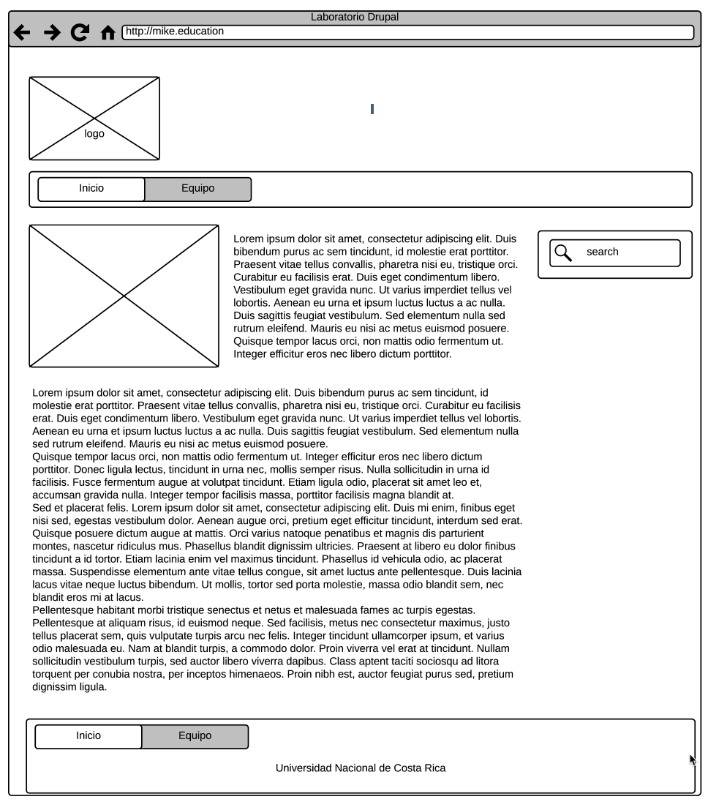
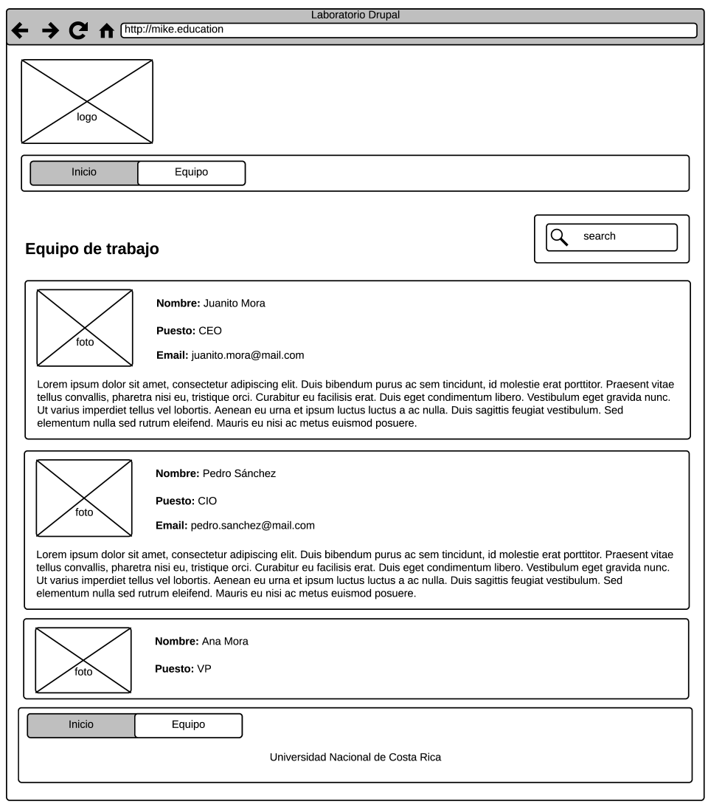

# Laboratorio 5 - CMS elaborando un Tema
Lo que se solicita:

- Instalar y configurar el Drupal
- Instalar el tema base de [Boostrap](https://www.drupal.org/project/bootstrap) para Drupal basado en SASS o LESS
- Drupal
    - Crear un content type denominado **Equipo de trabajo (equipo)** que incluya las siguientes propiedades
        - Foto de perfil (foto)
        - Nombre (nombre)
        - Puesto (puesto)
        - Biografía (biografia)
    - Home
        - Hacer una página que describa el sitio con una imagen

    - Equipo
        - Hacer una vista que presente una lista de **Equipo de trabajo** 

## Crear el Tema

- Crear un subtema con el nombre en el siguiente formato
    - **LabDrupalCedulaEstudiante**
    - Crear o modificar el CSS
    - Agregar y modificar los templates necesarios para que se vea el sitio web similar a los wireframes
    - Comprimirlo en ZIP, el nombre del archivo seria: **LabDrupal110600434.zip**
    - Instalarlo en la instancia que esta en la nube y que corresponde al grupo a que pertenece el estudiante.

*NOTA: únicamente versionar dentro de GitHub los archivos necesarios para el subtema, este es el punto que estaré evaluando*

**Probar el tema en el servidor en la nube.**

## Wireframes

A partir de los siguientes wireframes, desarrollar un tema para Drupal con Boostrap.

